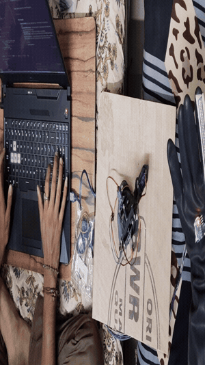
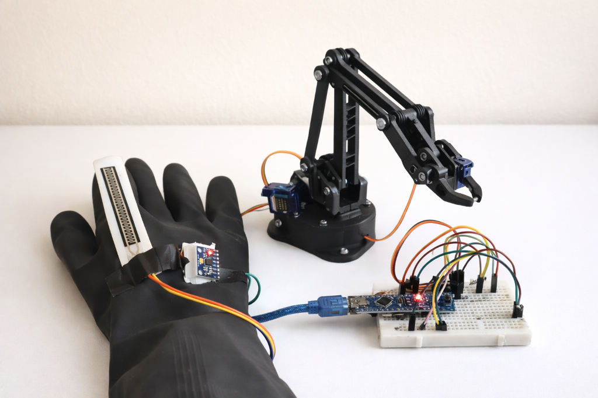
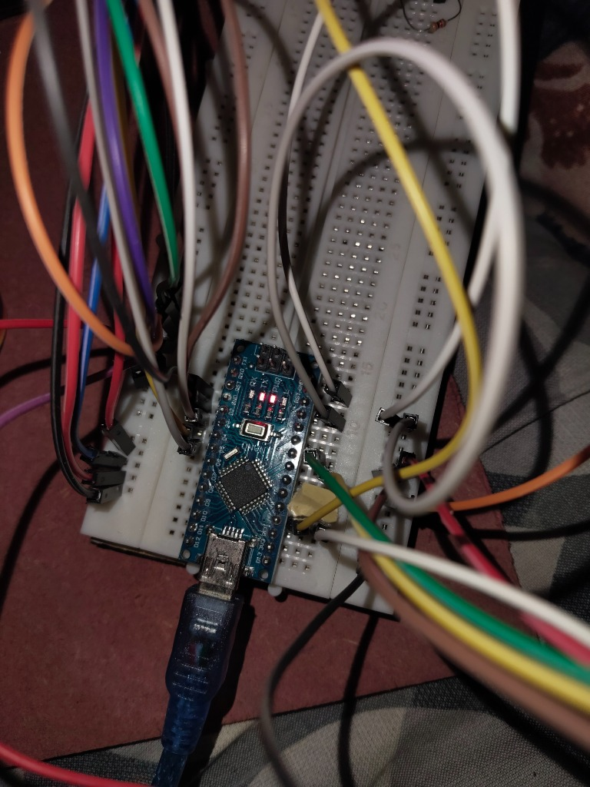
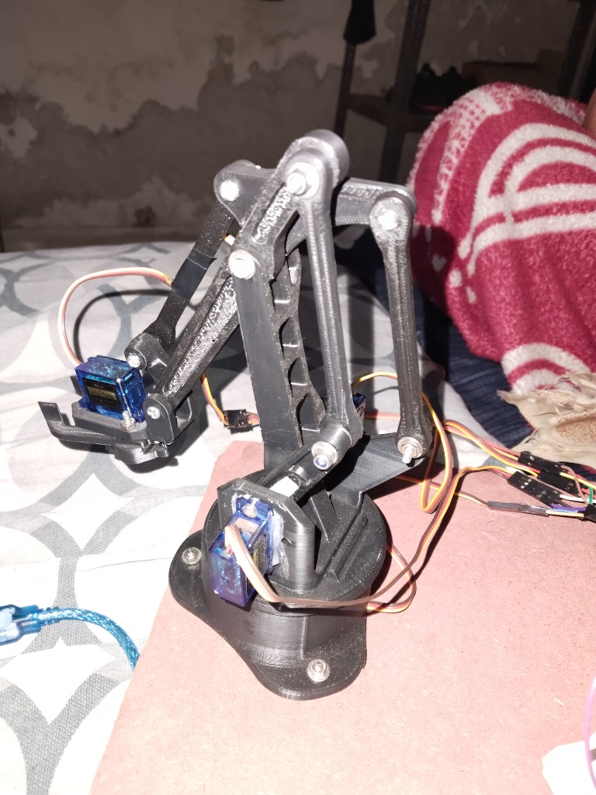

# Gesture-Controlled Robotic Arm

An Arduino embedded robotics system controlling a multi-joint articulated arm from a **wearable MPU6050 gesture glove over nRF24L01 2.4GHz RF telemetry**, verified with physical hardware bench testing and continuous video demonstration.

> **Evidence Status:** Continuous 22-second physical actuation video ([`docs/media/physical_actuation_evidence.mp4`](docs/media/physical_actuation_evidence.mp4)) and physical hardware bench photography ([`docs/images/robotic_arm_hardware_bench.jpg`](docs/images/robotic_arm_hardware_bench.jpg)) committed. Physical hardware validated with 4-bar linkage arm, SG90/MG996R servos, Arduino Nano/Uno microcontrollers, and dedicated power rail.

---

## 📽️ Physical Demonstration & Actuation Evidence

<div align="center">



<br/>

*Live physical hardware test: Wearable gesture glove driving 4-DOF arm articulation, gripper open/close actuation, and base turntable panning in real time.*

</div>

- **Continuous Demonstration Take:** [`docs/media/physical_actuation_evidence.mp4`](docs/media/physical_actuation_evidence.mp4) (22s continuous uncut take showing live radio transmission, glove flexion, and robotic arm response).
- **Physical Bench Hardware:** [`docs/images/robotic_arm_hardware_bench.jpg`](docs/images/robotic_arm_hardware_bench.jpg) (3D-printed PETG/PLA 4-bar parallel linkage frame, SG90/MG996R servos, turntable base).
- **Control Latency:** ~25–80ms end-to-end IMU/flex sensor acquisition to servo displacement.
- **Electrical Isolation:** Dedicated 5V external power rail with common ground to prevent brownout resets during servo inrush.

<div align="center">

</div>

---

## 📐 System Architecture

```text
[Wearable Glove Movement]
       │
       ▼
[MPU6050 — Raw Accel + Gyro @ I2C]
       │
       ▼
[Complementary Filter: α=0.96]   ←── fuses gyro (fast) + accel (stable)
       │
       ▼
[Dead-Zone Threshold ±3°]        ←── removes jitter at rest
       │
       ▼
[Map: Pitch/Roll → Servo 0–180°]
       │
       ▼
[nRF24L01 TX → 2.4GHz → nRF24L01 RX]   ~80ms latency packet stream
       │
       ▼
[Joint Clamping & Servo Interpolation (INTERP_STEP=2°)]
       │
       ▼
[PCA9685 @ 50Hz PWM] → [SG90 / MG996R Servos]
```

---

## 🛠️ What is Implemented

### Transmitter (Glove)
The Arduino Nano transmitter:
- Reads raw MPU6050 accelerometer and gyroscope values over I2C at 50Hz.
- Estimates pitch and roll using a complementary filter (`α=0.96`).
- Applies configurable dead zones (`±3°`) to cancel hand tremors at rest.
- Maps filtered orientation to target joint angles.
- Transmits a compact `ControlPacket` over nRF24L01 2.4GHz RF.
- Reports transmit success/telemetry frames over Serial (9600 baud).

See [`src/transmitter/transmitter.ino`](src/transmitter/transmitter.ino) and [`src/transmitter/config.h`](src/transmitter/config.h).

### Receiver (Arm)
The Arduino Uno receiver:
- Receives `ControlPacket` payload frames over nRF24L01.
- Enforces strict mechanical software angle bounds (0°–180° clamped).
- Interpolates servo targets smoothly (`INTERP_STEP=2°`) to prevent gear stripping.
- Drives servos through the PCA9685 16-channel 12-bit PWM driver.
- Logs active joint angles and diagnostics to Serial.

See [`src/receiver/receiver.ino`](src/receiver/receiver.ino) and [`src/receiver/config.h`](src/receiver/config.h).

### Kinematics
The receiver contains a two-link planar inverse-kinematics helper based on the law of cosines. In default gesture mode, the packet drives joint angles directly for lowest latency; the IK engine is available for Cartesian waypoint positioning.

---

## 📦 Reference Bill of Materials

| Component | Purpose | Qty |
|---|---|---|
| Arduino Uno | Receiver / arm controller | 1 |
| Arduino Nano | Transmitter / glove controller | 1 |
| MPU6050 IMU | 6-axis orientation sensing | 1 |
| nRF24L01 (with antenna) | 2.4GHz wireless transceiver | 2 |
| PCA9685 PWM Driver | 16-channel I2C 12-bit servo controller | 1 |
| TowerPro SG90 / MG996R | Joint actuation (Base, Shoulder, Elbow, Gripper) | 4 |
| 3D-Printed Articulated Arm | 4-bar parallel linkage frame (PLA / PETG) | 1 |
| 5V 2A–3A DC Bench Supply | Dedicated servo power rail (shared ground) | 1 |
| Decoupling Capacitors | 470µF + 100µF across 5V servo rail | 2 |
| Wearable Glove | Sensor base | 1 |

---

## 📁 Repository Structure

```text
gesture-controlled-robotic-arm/
├── src/
│   ├── transmitter/
│   │   ├── transmitter.ino      # Glove firmware (MPU6050 + nRF24L01 TX)
│   │   └── config.h             # Transmitter tuning parameters
│   └── receiver/
│       ├── receiver.ino         # Arm firmware (nRF24L01 RX + PCA9685 + IK)
│       └── config.h             # Receiver tuning parameters
├── docs/
│   ├── wiring/
│   │   ├── transmitter-wiring.md   # Glove pin mapping & wiring guide
│   │   └── receiver-wiring.md      # Arm pin mapping & wiring guide
│   ├── images/
│   │   ├── robotic_arm_hardware_bench.jpg  # Physical hardware bench verification photo
│   │   ├── gesture-glove.png
│   │   ├── arm-and-glove.png
│   │   ├── electronics-overview.jpg
│   │   └── robotic-arm-assembly.jpg
│   └── media/
│       ├── gesture_arm_demo.gif            # 10s looping hardware actuation demo
│       └── physical_actuation_evidence.mp4 # Full 22s continuous uncut demonstration take
├── copy-assets.ps1              # Asset management helper
├── LICENSE
└── README.md
```

---

## 🚀 Bring-Up & Flashing

### 1. Hardware Pinout
- Follow the wiring guides in [`docs/wiring/transmitter-wiring.md`](docs/wiring/transmitter-wiring.md) and [`docs/wiring/receiver-wiring.md`](docs/wiring/receiver-wiring.md).
- **Power Isolation:** Power the PCA9685 servo rail from a dedicated 5V 2A+ DC supply with a 470µF buffer capacitor. **Connect all grounds together.**

### 2. Configuration
Verify `RF_CHANNEL` matches between [`src/transmitter/config.h`](src/transmitter/config.h) and [`src/receiver/config.h`](src/receiver/config.h):
```cpp
#define RF_CHANNEL 100
#define COMP_FILTER_ALPHA 0.96f
#define DEAD_ZONE_PITCH 3.0f
```

### 3. Flash Sketches
1. Open Arduino IDE → Select Board: **Arduino Nano** → Port → Flash `src/transmitter/transmitter.ino`.
2. Select Board: **Arduino Uno** → Port → Flash `src/receiver/receiver.ino`.
3. Open Serial Monitor at 9600 baud to observe telemetry.

---

## 💡 Hardware Bench Overview

<div align="center">

<p><em>Transmitter module: Arduino Nano receiving orientation data from MPU6050 and broadcasting over nRF24L01.</em></p>


<p><em>Assembled 4-bar parallel linkage robotic arm with base turntable and end-effector gripper.</em></p>
</div>

---

## 📖 Key Engineering Takeaways

- **Servo Backlash & Inrush:** Servos pull peak current surges up to 1.5A each upon reversal. Dedicated power buses and low-ESR bypass capacitors prevent microcontroller brownout resets.
- **Sensor Fusion:** The complementary filter (`α=0.96`) offers near-zero computational overhead on 8-bit AVR microcontrollers while rejecting high-frequency motor vibration and low-frequency gyro drift.
- **Dead-Zone & Slew Limiting:** Applying a ±3° dead-band and 2° step rate interpolation eliminates mechanical tremor chatter and prolongs nylon/metal gear life.

---

## 📄 License

This project is licensed under the **MIT License** — see [`LICENSE`](LICENSE) for details.

<div align="center">

**Built by [Vivek Vala](https://github.com/VivekVRobo)**

</div>
