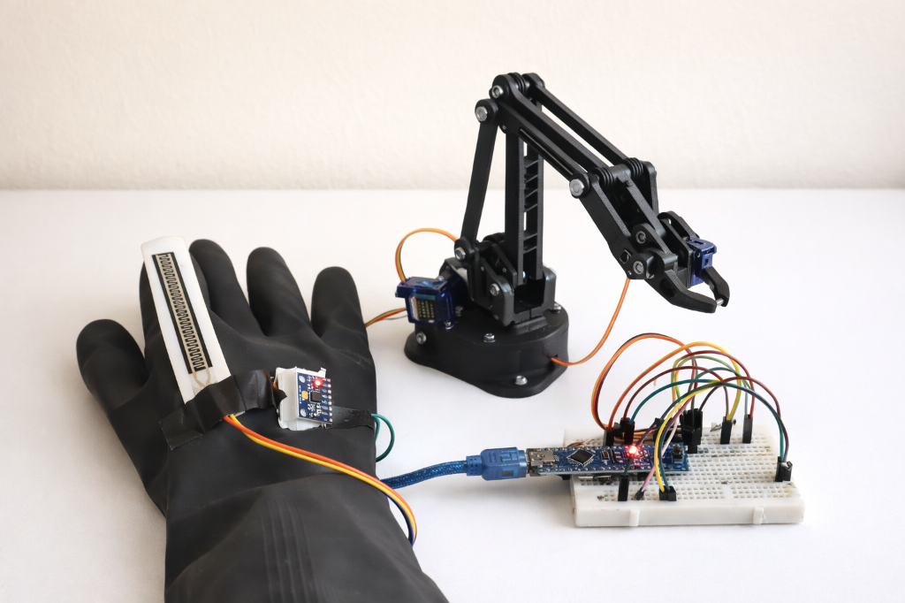
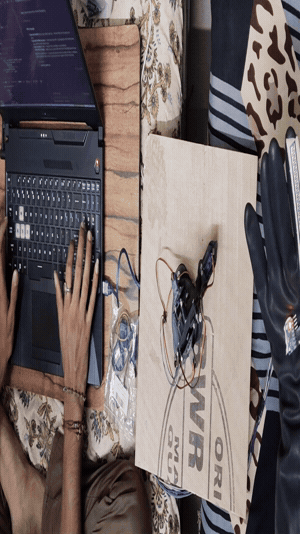
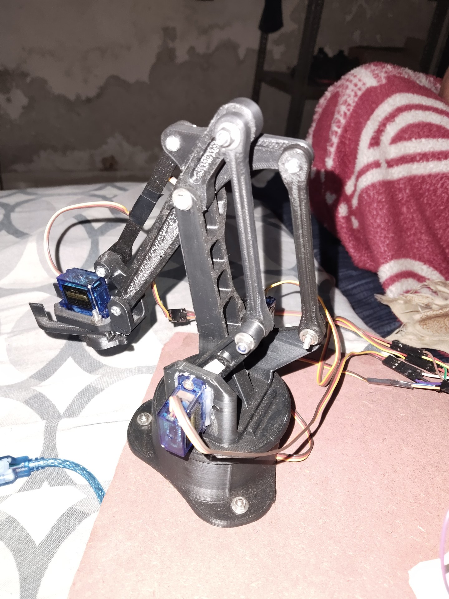
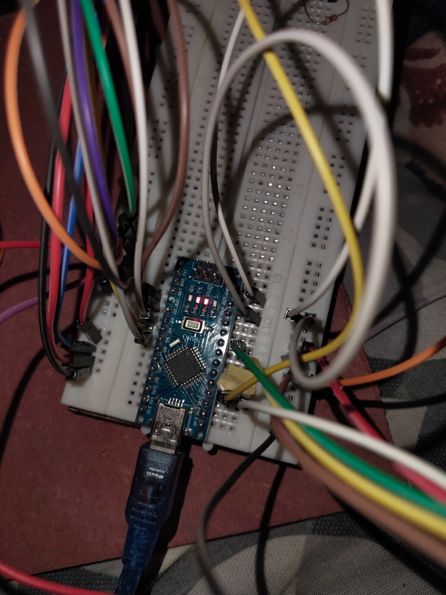
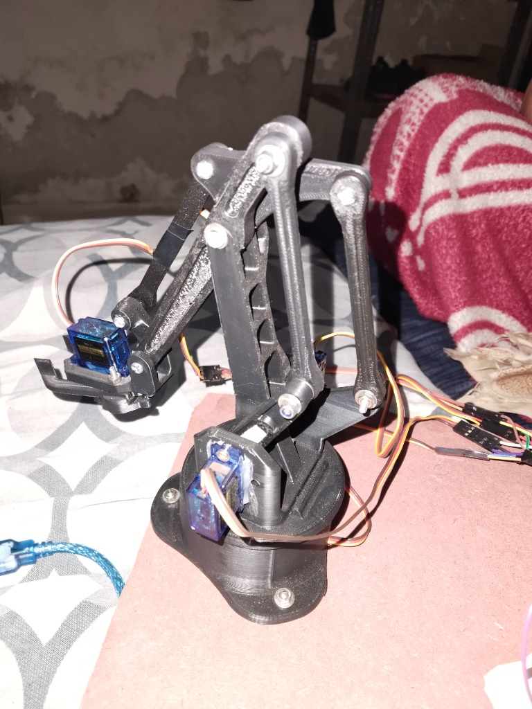

<div align="center">

# Gesture Controlled Robotic Arm

### Wearable IMU control · 2.4 GHz RF · Embedded motion control · Real hardware evidence

An Arduino embedded robotics system where a wearable MPU6050 glove drives a physical articulated robotic arm over nRF24L01 telemetry.

</div>

<p align="center">
  
  
  
  
  
  
</p>

<p align="center">
  <a href="docs/media/physical_actuation_evidence.mp4"><strong>Physical Actuation Video</strong></a> ·
  <a href="docs/images/robotic_arm_hardware_bench.jpg"><strong>Hardware Bench</strong></a> ·
  <a href="docs/wiring/transmitter-wiring.md"><strong>Glove Wiring</strong></a> ·
  <a href="docs/wiring/receiver-wiring.md"><strong>Arm Wiring</strong></a>
</p>

---

## Physical System

<p align="center">
  
</p>

**Wearable motion → IMU orientation → RF command → bounded motion control → physical arm actuation**

The complete system combines an Arduino Nano based glove transmitter, MPU6050 sensing, nRF24L01 radio telemetry, an Arduino Uno receiver, PCA9685 PWM generation, and SG90 / MG996R servo actuation.

> [!IMPORTANT]
> **Evidence boundary:** physical arm actuation, hardware bench photography, and a continuous 22 second demonstration are committed in this repository. Quantitative end to end control latency and repeatability measurements are still open and are not inferred from the video.

---

## Live Actuation Evidence

<p align="center">
  
</p>

The looping demonstration shows the wearable controller driving the physical arm in real time.

**Full continuous take:** [`physical_actuation_evidence.mp4`](docs/media/physical_actuation_evidence.mp4)

The full video is a continuous uncut hardware demonstration showing live glove input, RF control, and arm response.

---

## Evidence Board

| Surface | Evidence | Status |
| --- | --- | :---: |
| **Physical arm actuation** | GIF, continuous video, bench photography | ✅ Verified |
| **Wearable control path** | MPU6050 transmitter firmware and hardware | ✅ Implemented |
| **RF telemetry** | nRF24L01 transmitter and receiver path | ✅ Implemented |
| **Servo motion control** | PCA9685 output with bounded joint commands | ✅ Implemented |
| **Joint safety limits** | Explicit base, shoulder, elbow, and gripper bounds | ✅ Implemented |
| **Lost link behavior** | 1 second watchdog with failsafe park target | ✅ Implemented |
| **Motion smoothing** | Per joint velocity limits and exponential approach | ✅ Implemented |
| **IK helper** | Two link planar inverse kinematics with workspace rejection | ✅ Implemented |
| **Firmware verification suite** | Velocity, watchdog, clamping, deadband, and IK test coverage | ✅ Present |
| **End to end latency** | Instrumented measurement | ◐ Pending |
| **Physical repeatability** | Repeated measured endpoint behavior | ◐ Pending |

---

## System Architecture

```text
Wearable glove movement
        │
        ▼
MPU6050
accelerometer + gyroscope
        │
        ▼
Complementary filter
alpha = 0.96
        │
        ▼
Pitch / roll mapping
with ±3 degree dead zone
        │
        ▼
nRF24L01 transmitter
        │
        │  2.4 GHz command stream
        ▼
nRF24L01 receiver
        │
        ▼
Joint bounds + motion profile
        │
        ├── velocity limits
        ├── deadband
        ├── watchdog
        └── failsafe park
        │
        ▼
PCA9685 at 50 Hz
        │
        ▼
Base · Shoulder · Elbow · Gripper
```

The control loop runs at **50 Hz** on both the transmitter and receiver side.

---

## Engineering Controls

### Sensor fusion

The glove reads accelerometer and gyroscope data from the MPU6050 and combines them with a complementary filter:

`COMP_FILTER_ALPHA = 0.96`

A configurable **±3 degree dead zone** suppresses small hand tremors around the neutral orientation.

### Mechanical limits

The receiver clamps every incoming joint target to explicit software bounds before commanding the servos.

| Joint | Allowed range |
| --- | ---: |
| Base | 0° to 180° |
| Shoulder | 30° to 150° |
| Elbow | 0° to 160° |
| Gripper | 30° open to 120° closed |

### Motion profile

The receiver limits joint movement on each 20 ms control tick.

| Joint | Maximum configured rate |
| --- | ---: |
| Base | 100°/s |
| Shoulder | 90°/s |
| Elbow | 110°/s |
| Gripper | 200°/s |

An exponential approach factor of `0.22` slows the command near the target and reduces abrupt motion.

### Radio watchdog

If no valid radio packet is received for **1000 ms**, the receiver enters a lost link state and moves the arm toward configured home coordinates using a reduced failsafe park rate.

### Inverse kinematics

A two link planar inverse kinematics helper is available for Cartesian positioning.

Configured link lengths:

`L1 = 120 mm`  
`L2 = 100 mm`

Targets outside the reachable workspace are rejected instead of producing an invalid solution.

---

## Firmware Layout

### Glove transmitter

[`src/transmitter/transmitter.ino`](src/transmitter/transmitter.ino)

Responsibilities:

* read MPU6050 accelerometer and gyroscope data
* estimate pitch and roll
* apply dead zone filtering
* map orientation into control commands
* transmit a compact packet over nRF24L01
* report transmission telemetry over Serial

Configuration:

[`src/transmitter/config.h`](src/transmitter/config.h)

### Arm receiver

[`src/receiver/receiver.ino`](src/receiver/receiver.ino)

Responsibilities:

* receive RF control packets
* enforce mechanical joint bounds
* smooth target motion
* drive the PCA9685 servo controller
* enter failsafe park behavior after radio timeout
* expose joint diagnostics
* provide the planar IK helper

Configuration:

[`src/receiver/config.h`](src/receiver/config.h)

---

## Hardware Bench

<p align="center">
  
</p>

The physical arm uses a 3D printed parallel linkage frame with a base turntable, servo driven joints, and an end effector gripper.

<p align="center">
  
</p>

The wearable side combines the Arduino Nano, MPU6050, and nRF24L01 radio.

<p align="center">
  
</p>

---

## Reference Bill of Materials

| Component | Purpose | Qty |
| --- | --- | ---: |
| Arduino Uno | Arm receiver and controller | 1 |
| Arduino Nano | Wearable transmitter | 1 |
| MPU6050 | Six axis orientation sensing | 1 |
| nRF24L01 | 2.4 GHz radio telemetry | 2 |
| PCA9685 | 16 channel PWM servo control | 1 |
| SG90 / MG996R | Base, shoulder, elbow, gripper actuation | 4 |
| 3D printed arm | Parallel linkage mechanical frame | 1 |
| 5 V bench supply | Dedicated servo power rail | 1 |
| 470 µF + 100 µF capacitors | Servo rail decoupling | 2 |
| Wearable glove | Sensor mounting platform | 1 |

---

## Power Architecture

The servo rail is powered from a dedicated external **5 V supply** rather than from the microcontroller regulator.

All control electronics share a common ground.

This matters because servo reversals and startup current can cause voltage sag severe enough to reset a microcontroller if actuator power is not separated properly.

The committed bench design includes rail decoupling and a dedicated actuator supply.

---

## Verification Suite

[`tests/test_firmware_motion_engine.py`](tests/test_firmware_motion_engine.py) mirrors critical receiver behavior in Python and covers:

* strict velocity limiting
* deceleration behavior near the target
* radio timeout and failsafe state transition
* joint angle clamping
* reachable and unreachable IK workspace cases

This suite validates software behavior. It is not treated as a substitute for physical measurement.

---

## Bring Up

### 1. Wire the transmitter and receiver

Use:

* [Transmitter wiring](docs/wiring/transmitter-wiring.md)
* [Receiver wiring](docs/wiring/receiver-wiring.md)

Power the PCA9685 servo rail from a dedicated 5 V supply and connect the grounds between the servo supply and control electronics.

### 2. Verify shared radio configuration

The transmitter and receiver both use:

```cpp
#define RF_CHANNEL 100
```

The transmitter filter configuration includes:

```cpp
#define COMP_FILTER_ALPHA 0.96f
#define DEAD_ZONE_PITCH 3.0f
#define DEAD_ZONE_ROLL 3.0f
```

### 3. Flash the firmware

Flash:

* `src/transmitter/transmitter.ino` to the Arduino Nano
* `src/receiver/receiver.ino` to the Arduino Uno

Open the serial monitor to inspect radio and joint telemetry.

---

## Repository Structure

```text
gesture-controlled-robotic-arm/
├── src/
│   ├── transmitter/
│   │   ├── transmitter.ino
│   │   └── config.h
│   └── receiver/
│       ├── receiver.ino
│       └── config.h
├── tests/
│   └── test_firmware_motion_engine.py
├── docs/
│   ├── wiring/
│   │   ├── transmitter-wiring.md
│   │   └── receiver-wiring.md
│   ├── images/
│   │   ├── robotic_arm_hardware_bench.jpg
│   │   ├── gesture-glove.png
│   │   ├── arm-and-glove.png
│   │   ├── electronics-overview.jpg
│   │   └── robotic-arm-assembly.jpg
│   └── media/
│       ├── gesture_arm_demo.gif
│       └── physical_actuation_evidence.mp4
├── CONTRIBUTING.md
├── RELEASE_READINESS.md
├── RELEASE_NOTES_DRAFT.md
├── LICENSE
└── README.md
```

---

## Current Proof Priorities

1. instrument and publish end to end glove to actuator latency
2. measure joint and endpoint repeatability across repeated commands
3. publish calibrated servo error measurements
4. extend physical failsafe validation under controlled radio loss
5. preserve reproducible hardware evidence for future firmware changes

---

## Contributing

Contributions are useful in:

* firmware and motion control
* reproducible RF and latency benchmarking
* servo calibration
* safety and watchdog behavior
* wiring documentation
* physical measurement tooling
* automated verification

See [`CONTRIBUTING.md`](CONTRIBUTING.md).

---

## Release Status

The repository includes [`RELEASE_READINESS.md`](RELEASE_READINESS.md) and [`RELEASE_NOTES_DRAFT.md`](RELEASE_NOTES_DRAFT.md).

Any release should preserve the same evidence boundary used throughout the project. Physical actuation may be claimed from the committed hardware evidence. Quantitative latency, accuracy, and repeatability should remain excluded until measured.

---

## License

MIT. See [`LICENSE`](LICENSE).

<div align="center">

**Built by [Vivek Vala](https://github.com/VivekVRobo)**

Physical robotics · Embedded control · Evidence driven engineering

</div>
